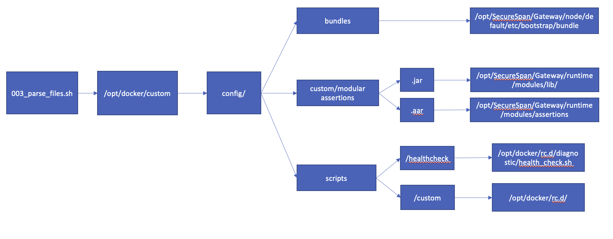

## Gateway Init Container Examples
This repository provides examples of how to configure initContainers for the Layer7 API Gateway to load files into the right locations for bootstrap. This avoids the majority of use cases you might have for maintaining a custom gateway image.

### Examples
There are 2 examples that you can use to get started. Each example provides a values file for the Gateway Helm Chart to simplify trying these options out.

- [Simple](./examples/simple)
- [Dynamic](./examples/dynamic)

#### Prerequisites
- Access to a Kubernetes Cluster (developed against 1.23)
- kubectl (Kubernetes CLI)
- Helm v3.x
- Gateway Helm Chart v3.0.2 or greater
- Clone this repository
  - ```$ git clone https://github.com/Layer7-Community/Utilities```
  - ```$ cd Utilities/gateway-init-container/```
- Place a Gateway v10 license file in ${REPO_PATH}/gateway-init-container/gateway. The file should be called 'license' with ***no extension***

#### Note
The API Gateway is configured to run in ephemeral mode in these examples.

### Install
The install process creates a namespace called layer7 and deploys the necessary resources for the example.

***NOTE:*** The install process automatically sets license.accept to true
- ```$ cd ${REPO_PATH}/gateway-init-container```

Simple Example
- ```$ make install simple```

Dynamic Example
- ```$ make install dynamic```

- The kustomization.yaml (in the Gateway folder) file will create the following in the layer7 namespace
  - Secrets
    - ssg-license
    - ssg-secret
    - init-secret (used by the dynamic initContainer)

### Uninstall
The uninstall process simply deletes the layer7 namespace created on install

```$ make uninstall```

### [Shared volumes](https://kubernetes.io/docs/tasks/access-application-cluster/communicate-containers-same-pod-shared-volume/)
Shared volumes allow us to create a mount point between containers running in the same Kubernetes Pod.

#### initContainer
- Working Directory (WORKDIR) - ```/config```

```
Dockerfile
----------
FROM busybox

WORKDIR /config
COPY config .
USER 65532:65532
```

- Shared Volume - ```/opt/docker/custom```

```
gateway-values.yaml
-------------------
initContainers:
- name: custom-init
  image: docker.io/layer7api/simple-init:1.0.0
  imagePullPolicy: Always
  volumeMounts:
  - name: config-directory
    mountPath: /opt/docker/custom
  command: ["/bin/cp"]
  args: ["-r",".", "/opt/docker/custom/"]
```

### Folder Format
These initContainers work in conjunction with a script the Gateway Helm Chart provides that runs on the Container Gateway.

- Enabled with the following flag in the Gateway values file.

```
boostrap:
  script:
    enabled: true
```
##### All files, whether loaded in dynamically or simply copied will need to follow this folder structure.



- Restman Bundles (.bundle)
  - Source ```/opt/docker/custom/bundles```
  - Target ```/opt/SecureSpan/Gateway/node/default/etc/bootstrap/bundle```
- Custom Assertions (.jar)
  - Source ```/opt/docker/custom/custom-assertions```
  - Target ```/opt/SecureSpan/Gateway/runtime/modules/lib/```
- Modular Assertions (.aar)
  - Source ```/opt/docker/custom/modular-assertions```
  - Target ```/opt/SecureSpan/Gateway/runtime/modules/assertions```
- Scripts (.sh)
  - Custom
    - Source ```/opt/docker/custom/scripts/custom```
    - Target ```/opt/docker/rc.d/```
  - Health Check
    - Source ```/opt/docker/custom/scripts/healthcheck/healthcheck.sh```
    - Target ```/opt/docker/rc.d/diagnostic/healthcheck.sh```


## Build your own initContainer

- Simple
  - Clone this repository
    - git clone https://github.com/Layer7-Community/Utilities
  - cd Utilities/gateway-init-container/examples/simple
  - Replace the content of config with your own files
    - ./config contains the correct folder structure
  - Build the image
    - ```$ docker build -t <yourimagetag> .```
  - Push the image to an image repository
    - ```$ docker push <yourimagetag>```

- Dynamic
  - Clone this repository
    - ```$ git clone https://github.com/Layer7-Community/Utilities```
  - ```$ cd Utilities/gateway-init-container/examples/dynamic```
  - Replace the content of config with your own files
    - ./config contains the correct folder structure
  - Update scripts
    - Add your own bash scripts (.sh)
    - Add your own python scripts (.py)
      - The base entrypoint will only execute python scripts that are prefixed with ```preboot_<name>.py```
  - Build the image
    - ```$ docker build -t <yourimagetag> .```
  - Push the image to an image repository
    - ```$ docker push <yourimagetag>```
