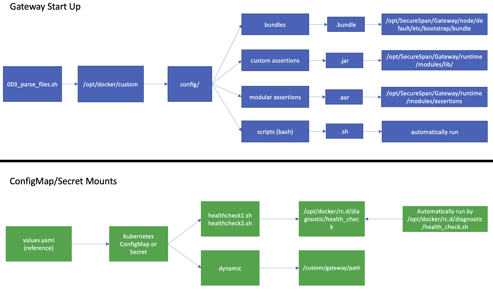

## Gateway Init Container Examples
This repository provides examples of how to configure initContainers for the Layer7 API Gateway to load files into the right locations for bootstrap. This avoids the majority of use cases you might have for maintaining a custom gateway image.

### Important note
Files loaded onto the container gateway's filesystem will generally not be encrypted, meaning if a user has direct access (exec) they will be able to view/copy them.

This level of access is generally (and should be) restricted presenting a low level of risk. If you are looking for an alternative to bootstrap for your MySQL-backed Gateway deployment then Restman is the best approach.

***NOTE:*** The install process automatically sets license.accept to true. By using this example you accepting the license agreement.

### Examples
There are 2 examples that you can use to get started. Each example provides a values file for the Gateway Helm Chart to simplify trying these options out.

- [Simple](./examples/simple)
  - [simple-gateway-values.yaml (Helm)](./gateway/helm/simple-gateway-values.yaml)
- [Dynamic](./examples/dynamic)
  - [dynamic-gateway-values.yaml (Helm)](./gateway/helm/dynamic-gateway-values.yaml)

#### Prerequisites
- Access to a Kubernetes Cluster (developed against 1.23)
- kubectl (Kubernetes CLI)
- Helm v3.x
- Gateway Helm Chart v3.0.2 or greater
- Clone this repository
  - ```$ git clone https://github.com/Layer7-Community/Utilities```
  - ```$ cd Utilities/gateway-init-container/```
- Place a Gateway v10 license file in ```${REPO_PATH}/gateway-init-container/gateway```. The file should be called 'license' with ***no extension***

#### Note
The API Gateway is configured to run in ephemeral mode in these examples.

### Install
The install process creates a namespace called layer7 and deploys the necessary resources for the example.

- ```$ cd ${REPO_PATH}/gateway-init-container```

Simple Example
- ```$ make install simple```
```
$ kubectl apply -k ./gateway
$ helm repo add layer7 https://caapim.github.io/apim-charts/
$ helm repo update
$ helm install ssg -f ./gateway/helm/simple-gateway-values.yaml -n layer7 layer7/gateway
```
Dynamic Example
- ```$ make install dynamic```
```
$ kubectl apply -k ./gateway
$ helm repo add layer7 https://caapim.github.io/apim-charts/
$ helm repo update
$ helm install ssg -f ./gateway/helm/dynamic-gateway-values.yaml -n layer7 layer7/gateway
```

- The kustomization.yaml (in the Gateway folder) file will create the following in the layer7 namespace
  - Secrets
    - ssg-license
    - ssg-secret
    - init-secret (used by the dynamic initContainer)
    - healthcheck-scripts-secret
    - config-override-secret 
  - ConfigMaps
    - healthcheck-scripts-configmap
    - config-override-configmap

Accessing the Gateway
- ```$kubectl get svc -n layer7```
```
NAME          TYPE           CLUSTER-IP     EXTERNAL-IP           PORT(S)                         AGE
ssg-gateway   LoadBalancer   10.68.15.237   <public-ip-address>   8443:31658/TCP,9443:31116/TCP   55m
```
- Policy Manager - [gateway.env](./gateway/gateway.env)
  - username: admin
  - password: mypassword
- ```$ curl https://<public-ip-address>:8443/helloworld```


### Uninstall
The uninstall process simply deletes the layer7 namespace created on install

```$ make uninstall```

### [Shared volumes](https://kubernetes.io/docs/tasks/access-application-cluster/communicate-containers-same-pod-shared-volume/)
Shared volumes allow us to create a mount point between containers running in the same Kubernetes Pod.

#### initContainer
- Working Directory (WORKDIR) - ```/config```

```
Dockerfile
----------
FROM busybox

WORKDIR /config
COPY config config
COPY entrypoint.sh .
CMD [ "/bin/sh", "./entrypoint.sh" ]
```

- Shared Volume - ```/opt/docker/custom```

```
gateway-values.yaml
-------------------
initContainers:
- name: simple-init
  image: docker.io/layer7api/simple-init:1.0.0
  imagePullPolicy: Always
  volumeMounts:
  - name: config-directory
    mountPath: /opt/docker/custom
```

### Folder Format
These initContainers work in conjunction with a script the Gateway Helm Chart provides that runs on the Container Gateway.

- Enabled with the following flag in the Gateway values file. The cleanup flag removes the contents in /opt/docker/custom before exiting.

```
boostrap:
  script:
    enabled: true
  cleanup: true
```
##### All files, whether loaded in dynamically or simply copied will need to follow this folder structure.



- Restman Bundles (.bundle)
  - Source ```/opt/docker/custom/bundles```
  - Target ```/opt/SecureSpan/Gateway/node/default/etc/bootstrap/bundle```
- Custom Assertions (.jar)
  - Source ```/opt/docker/custom/custom-assertions```
  - Target ```/opt/SecureSpan/Gateway/runtime/modules/lib/```
- Modular Assertions (.aar)
  - Source ```/opt/docker/custom/modular-assertions```
  - Target ```/opt/SecureSpan/Gateway/runtime/modules/assertions```

### ConfigMap/Secrets
These examples can be configured to use custom health checks and custom configuration files. Healthchecks are defined [here](./gateway/scripts/healthcheck/) folder, Custom config files are defined [here](./gateway/properties/). Both of these directories are used in [kustomization.yaml](./gateway/kustomization.yaml) to create configmaps/secrets 

- Custom Health Checks
```
existingHealthCheck:
  enabled: false
  configMap:
    name: healthcheck-scripts
    # defaultMode: 292
    # optional: false
  secret:
    # name: healthcheck-scripts
    # csi:
    #   driver: secrets-store.csi.k8s.io
    #   readOnly: true
    #   volumeAttributes:
    #     secretProviderClass: "vault-database"
```
- Custom Configuration Files
```
customConfig:
  enabled: true
  mounts:
  - name: sampletrafficloggerca-override
    mountPath: /opt/SecureSpan/Gateway/node/default/etc/conf/sampletrafficloggerca.properties
    subPath: sampletrafficloggerca.properties
    configMap:
      name: config-override-configmap
      item:
        key: sampletrafficloggerca.properties
        path: sampletrafficloggerca.properties
  - name: ssg-security-override
    mountPath: /opt/SecureSpan/Gateway/runtime/etc/ssg.security
    subPath: ssg.security
    secret:
      name: config-override-secret
      item:
        key: ssg.security
        path: ssg.security
```

## Build your own initContainer

- Simple
  - Clone this repository
    - git clone https://github.com/Layer7-Community/Utilities
  - cd Utilities/gateway-init-container/examples/simple
  - Replace the content of config with your own files
    - ./config contains the correct folder structure
  - Build the image
    - ```$ docker build -t <yourimagetag> .```
  - Push the image to an image repository
    - ```$ docker push <yourimagetag>```

- Dynamic
  - Clone this repository
    - ```$ git clone https://github.com/Layer7-Community/Utilities```
  - ```$ cd Utilities/gateway-init-container/examples/dynamic```
  - Replace the content of config with your own files
    - ./config contains the correct folder structure
  - Update scripts
    - Add your own bash scripts (.sh)
    - Add your own python scripts (.py)
      - The base entrypoint will only execute python scripts that are prefixed with ```preboot_<name>.py```
  - Build the image
    - ```$ docker build -t <yourimagetag> .```
  - Push the image to an image repository
    - ```$ docker push <yourimagetag>```
