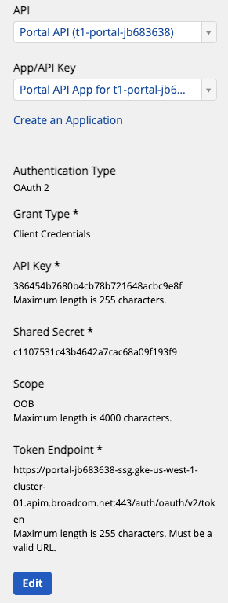
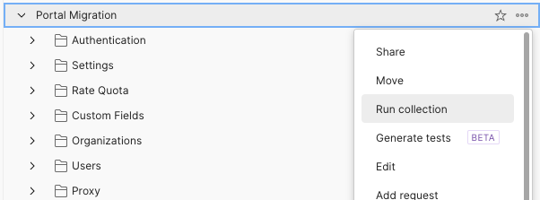
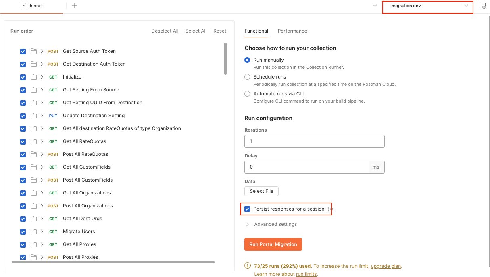

# portal-postman-migration
This postman collection is used to migrate data from one source Portal to a destination Portal. 
It leverages the Portal API (PAPI) to make API calls from the source Portal to the destination Portal.

## Environment Properties
Importing the Postman collection will also import the **migration env** environment configuration. 
This contains all the variables used by the collection to execute the migration containing
hostnames and Portal API credentials.

For the apiKey, secret, ssgUrl, ssgPort and apimTenantUrl properties, these are easily fetched from
accessing the [Portal API link](https://techdocs.broadcom.com/us/en/ca-enterprise-software/layer7-api-management/api-developer-portal/saas/manage/manage-apis/test-and-explore-apis/explore-apis.html)
from your source and destination Portals. After selecting the Portal API for your tenant, you should
see the rest of the properties load like so:

The **Token Endpoint** shows the ssgUrl and ssgPort.
The **apimTenantUrl** is the hostname shown in the browser URL after being redirected when clicking
Portal API.

Assuming you have a **source Portal** with the URL: **source-portal.layer7.saas.broadcom.com**
And a **destination Portal** with the URL: **destination-portal.layer7.onprem.broadcom.com**

| Variable            | Example Value                                     | Description                                                              |
|---------------------|---------------------------------------------------|--------------------------------------------------------------------------|
| sourceTenantUrl     | source-portal.layer7.saas.broadcom.com            | The fully-qualified hostname of your source Portal.                      |
| sourceTenantId      | source-portal                                     | The tenant ID prefix of your source Portal.                              |
| sourceSsgUrl        | apim-ssg.layer7.saas.broadcom.com                 | The Ingress Gateway hostname for your source Portal.                     |
| sourceSsgPort       | 443                                               | The Ingress Gateway port for your source Portal.                         |
| sourceApiKey        | 6448269cc69f4604b735175182fb8aec                  | The API key used to call PAPI of your source Portal.                     |
| sourceSecret        | 27d233fafce5415c8e7a8a1247695c51                  | The API key secret used to call PAPI of your source Portal.              |
| destApiKey          | 386454b7680b4cb78b721648acbc9e8f                  | The API key used to call PAPI of your destination Portal.                |
| destSecret          | c1107531c43b4642a7cac68a09f193f9                  | The API key secret to call PAPI of your destination Portal.              |
| destTenantId        | destination-portal                                | The tenant ID prefix of your destination Portal.                         |
| destTenantUrl       | destination-portal.layer7.onprem.broadcom.com     | The fully-qualified hostname of your destination Portal.                 |
| destSsgUrl          | destination-portal-ssg.layer7.onprem.broadcom.com | The Ingress Gateway hostname for your destination Portal.                |
| destSsgPort         | 9443                                              | The Ingress Gateway port for your destination Portal.                    |
| sourceApimTenantUrl | apim.layer7.saas.broadcom.com                     | The Ingress tenant hostname for your source Portal.                      |
| destApimTenantUrl   | apim.layer7.onprem.broadcom.com                   | The Ingress tenant hostname for your destination Portal.                 |
| sourceDocLocale     | en-us                                             | The locale to use when exporting documents from your source Portal.      |
| destDocLocale       | en-us                                             | The locale to use when importing documents into your destination Portal. |

## Pre-conditions
For API migrations, all [Policy Templates](https://techdocs.broadcom.com/us/en/ca-enterprise-software/layer7-api-management/api-developer-portal/saas/manage/manage-policy-templates.html) from the source Portal must first be migrated to the
destination Portal. As these are Gateway entities, they should be migrated using GMU prior to executing
the Portal migration. This of course requries you to have at least one Gateway enrolled with the destination
Portal where these Policy Templates are migrated to. To verify this, you can use PAPI to call /policyTemplates
on both Portals and ensure that all the ones from the source Portal exist in the destination Portal.

For Gateway Bundle migrations, a local server is required to persist the bundle data into Postman's 
working folder, see ResponseToFile-Postman subfolder for more detail.

# Running the Collection
1. Read and do the pre-conditions above
2. Import the collection into Postman
3. Set the environment configuration variables
4. Run the **Portal Migration** collection by right-clicking and selecting **Run Collection**.
   
5. With the runner configuration open:

    - ensure that you have selected the **migration env** configuration in the top-right
    - also check the box to **Persist responses** to allow for easier debugging
    - from here, you can also specify which collections you want to run or skip which may be necessary if you need to re-run the migration
    - click **Run Portal Migration** to execute it  
6. The collection can be run multiple times but you may have failures on entities that were previously created. You can also modify the run to exclude those collections but ensure you exclude all the steps from the collection.
   - hovering over the folder-icon will show you which collection the request is from