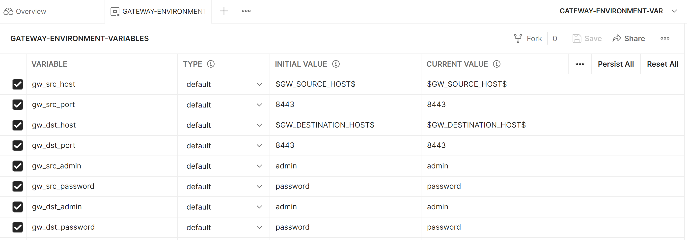
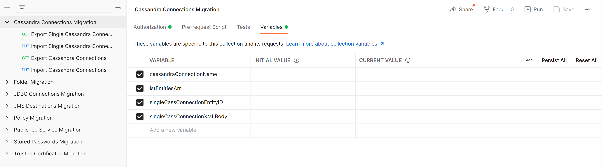
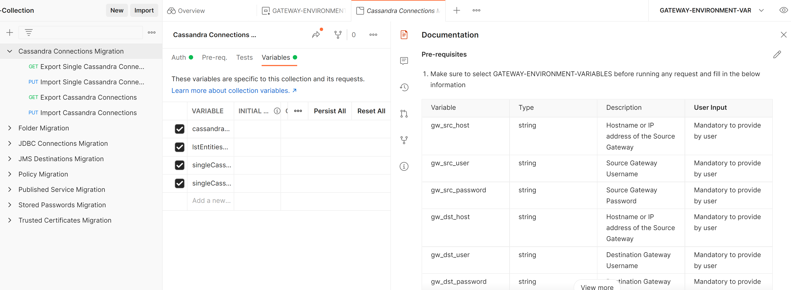

# Gateway_Postman_Collection

There are two collections sets,

* One is environmentCollection where we can configure Source/Destination host and port details. And Policy Manager login credentials.

* Second one is entityCollection where we can execute entity migration.
  
End user have to import both the collections in postman.

Environment variables looks like this, Need to provide Source/Destination host and port details and login credentials as well.
 
 
 
Entities collection looks like this, Individually can run each collection. For Trusted certificates, Stored Passwords, JMS destinations, JDBC connection migrations,
We can run single entity migration or All entities migrations at once. In Run collection window we need to select which one we should run.

Documentation

Each collection have pretty much documented seperately. We just need click on Documentation in postman to view as below,

